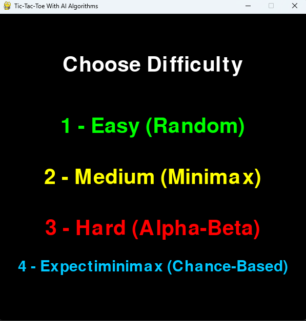
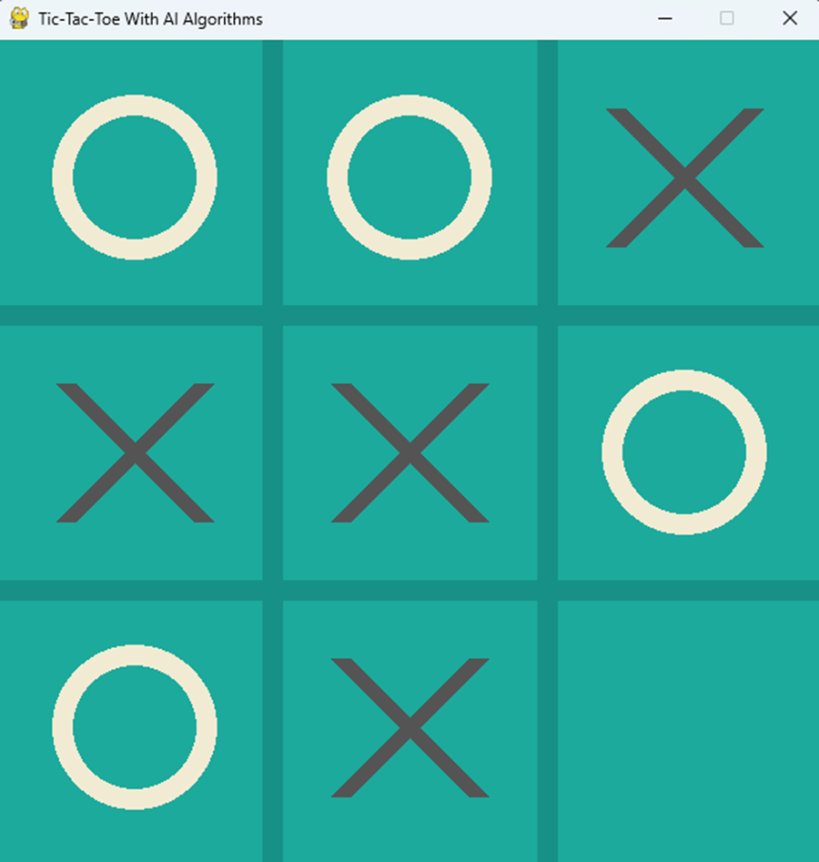

# 🎮 Tic-Tac-Toe with AI Algorithms

An advanced Python-based Tic-Tac-Toe game where you play as **X** against an AI that uses one of four algorithms:
- Random
- Minimax
- Alpha-Beta Pruning
- Expectiminimax (Chance-Based)

Built with `pygame`, this project is designed for both fun and academic understanding of AI search strategies.

---

## 🧠 AI Strategies

| Mode | Description |
|------|-------------|
| 1. Easy | Picks a random move |
| 2. Medium | Uses classic Minimax |
| 3. Hard | Uses Minimax + Alpha-Beta Pruning |
| 4. Expectiminimax | Considers possible move failure (70% success / 30% fail) and calculates expected values |

The Expectiminimax version introduces **chance nodes**, making the AI evaluate both success and failure paths before choosing a move.

---

## 🕹️ Controls

- Press `1`, `2`, `3`, or `4` to select AI difficulty
- Click on a square to make your move
- The AI responds based on the selected strategy
- Game ends when there’s a win or draw

---

## 📷 Screenshots


  


---

## 🚀 How to Run

1. Install requirements:
   ```bash
   pip install pygame
   ```

2. Run the game:
   ```bash
   python gui.py
   ```

3. For console version (text-based):
   ```bash
   python main.py
   ```

---

## 📚 Expectiminimax Contribution

This project goes beyond traditional AI by implementing **Expectiminimax**, a decision-making algorithm that:
- Handles uncertainty using simulated chance nodes
- Calculates expected value for each move: `0.7 * success_score + 0.3 * fail_score`
- Introduces realistic unpredictability into a deterministic game
- Demonstrates planning under uncertainty


---

## 📁 Project Structure

```
.
├── gui_main.py              # GUI version using pygame
├── main.py                  # Console version
├── tictactoe.py             # Shared game logic
├── minimax_ai.py
├── alpha_beta_ai.py
├── expectiminimax_ai.py     # New algorithm (chance-based)
├── assets/
│   └── sounds/              # Sound effects
└── README.md                # This file
```


